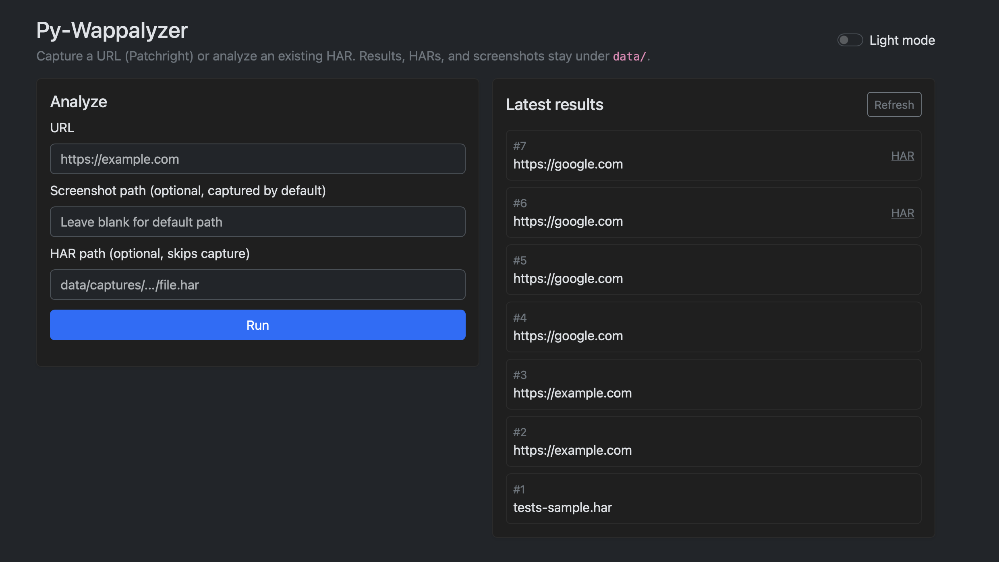
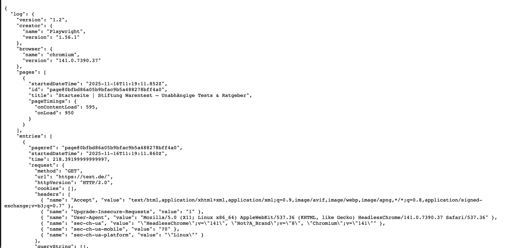
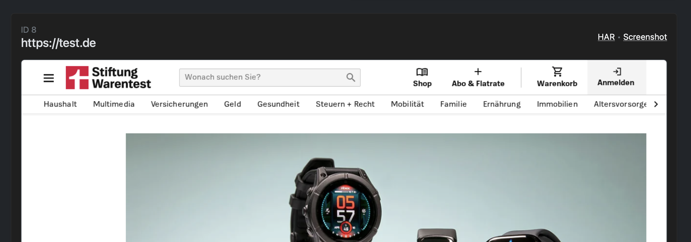

<div align="center">
  

  <h1>🐍 Py-Wappalyzer</h1>
  <p><strong>Detect web technologies from HAR files or live pages.</strong></p>
</div>

<div align="center">
  
  <p><em>FastAPI web UI: capture or analyze, see results and history</em></p>
</div>

---

## Overview

Py-Wappalyzer inspects HAR data to fingerprint technologies (similar to Wappalyzer/Webappanalyzer). It can:

- Parse HAR files for HTML, scripts, headers, cookies, and meta
- Capture a HAR from a live URL using Patchright (optional screenshot)
- Return confidence, versions, categories, and groups
- Run as a CLI or be imported as a library
- Store results in a local SQLite database under `data/`
- Keep captured HARs (and optional screenshots) under `data/captures` / `data/screenshots`

---

## Installation

```bash
pip install py-wappalyzer             # core library + CLI (HAR analysis only)
pip install py-wappalyzer[cli]        # + patchright for live capture
pip install py-wappalyzer[web]        # + FastAPI/uvicorn/jinja2 for web/API
pip install py-wappalyzer[full]       # everything (capture + web)
```

> Patchright needs browsers installed. Run `patchright install chromium` (or docs) before using `--url`.
> To keep downloads inside this project, set `WAPPALYZER_BROWSERS=./browsers` (default) so Patchright uses that path.
> Fingerprint data lives under `data/wappalyzer-data` by default; override with `WAPPALYZER_DATA_DIR`.
> Captured HARs go under `data/captures/YYYY/MM/DD/...`, screenshots under `data/screenshots/...`; override with `WAPPALYZER_CAPTURE_DIR` / `WAPPALYZER_SCREENSHOT_DIR`.

---

## CLI Usage

Detect from an existing HAR (default flow):

```bash
python -m py_wappalyzer --har path/to/site.har --format pretty
```

Capture a URL with Patchright, optionally save a screenshot:

```bash
python -m py_wappalyzer --url https://example.com \
  --screenshot out/example.png \
  --output out/result.json
```

Options:
- `--har PATH` Analyze an existing HAR file.
- `--url URL` Capture and analyze a live page (requires Patchright + browsers).
- `--screenshot PATH` Save a screenshot during capture (URL mode only).
- `--format json|pretty` Output format (default json).
- `--output PATH` Write results to a file instead of stdout.
- `--verbose` Enable debug logs.
- `--refresh-data` Force re-download of fingerprint data.

Exit code is non-zero on errors (missing HAR, capture failure, etc.).

---

## Web UI / API (FastAPI, SQLite-backed)

Run a FastAPI web server with a minimal UI (Jinja) and JSON API:

```bash
python -m py_wappalyzer.web  # serves on http://localhost:8000
```

- Visit `/` for a simple form to capture a URL (uses Patchright, requires browsers).
- `POST /api/analyze` with JSON `{ "url": "https://example.com" }` or `{ "har_path": "file.har" }`.
- `GET /api/history?limit=10` returns recent detections (stored in SQLite at `data/py_wappalyzer.db` by default; override with `WAPPALYZER_DB`).
- API responses include stored `har_path` and optional `screenshot_path` when captures are performed.
- `GET /healthz` returns service status.
- Optional auth (disabled by default):
  - API bearer: set `WAPPALYZER_API_BEARER=token`
  - Web basic auth: set `WAPPALYZER_WEB_USER=user` and `WAPPALYZER_WEB_PASS=pass`

<div align="center">
  
  <p><em>Analyze HAR or live capture; see detected tech and metadata</em></p>
</div>

<div align="center">
  
  <p><em>Captured screenshot displayed alongside detections</em></p>
</div>

## Docker

Build and run the API/UI with Patchright + Chromium baked in:

```bash
docker build -t py-wappalyzer .
docker run -p 8000:8000 \
  -e WAPPALYZER_WEB_USER=user -e WAPPALYZER_WEB_PASS=pass \
  -v pywappalyzer-data:/app/data \  # persist fingerprints, DB, captures, screenshots
  py-wappalyzer
```

The container keeps browsers under `/app/browsers`, fingerprint data under `/app/data/wappalyzer-data`, and the SQLite DB at `/app/data/py_wappalyzer.db`.

Auth: set `WAPPALYZER_WEB_USER`/`WAPPALYZER_WEB_PASS` (applies to both UI and API). API accepts either `Basic user:pass` or `Bearer user:pass` headers. If you prefer a separate token, set `WAPPALYZER_API_BEARER`.

## Deploy / Run

- Local CLI: `python -m py_wappalyzer --url https://example.com --format pretty`
- Local web/API: `python -m py_wappalyzer.web` then open `http://localhost:8000`
- Docker: `docker run -p 3001:8000 py-wappalyzer` then open `http://localhost:3001`
- Auth (optional): set `WAPPALYZER_API_BEARER` and/or `WAPPALYZER_WEB_USER`/`WAPPALYZER_WEB_PASS`

## Security Defaults

- Auth is **off by default**. For public exposure, set either:
  - Basic auth: `WAPPALYZER_WEB_USER` + `WAPPALYZER_WEB_PASS` (applies to UI and API).
  - Bearer: `WAPPALYZER_API_BEARER` or simply use `Bearer user:pass` when basic is set.
- File serving via `/files` is restricted to the project’s `data/` subpaths (captures/screenshots/fingerprints).
- Requests are unauthenticated unless you set the env vars above; if deploying in production, enforce TLS at the edge (ingress/reverse proxy) and restrict ingress as needed.

## Deployment Notes

- Data paths default to the project or container: fingerprints (`data/wappalyzer-data`), captures (`data/captures/...`), screenshots (`data/screenshots/...`), DB (`data/py_wappalyzer.db`). Override via `WAPPALYZER_DATA_DIR`, `WAPPALYZER_CAPTURE_DIR`, `WAPPALYZER_SCREENSHOT_DIR`, `WAPPALYZER_DB`.
- Patchright browsers default to `./browsers` (or `/app/browsers` in Docker); set `WAPPALYZER_BROWSERS`/`PLAYWRIGHT_BROWSERS_PATH` to move them.
- Health: `GET /healthz` for basic status; add monitoring/rate limits at your ingress if exposing publicly.

---

## Library Usage

Detect from a HAR file path:

```python
from py_wappalyzer import detect_technologies

results = detect_technologies(har_path="path/to/site.har")
for tech in results:
    print(tech["name"], tech["confidence"], tech["versions"])
```

Detect from structured JSON (HAR-like):

```python
from py_wappalyzer import detect_technologies

payload = {
    "url": "https://example.com",
    "html": "<html>...</html>",
    "headers": {"server": "nginx"},
    "cookies": {},
    "scripts": ["https://cdn.example/app.js"],
    "meta": {"generator": "WordPress"},
}

results = detect_technologies(json_data=payload)
```

Capture a HAR first, then analyze:

```python
from py_wappalyzer.capture import capture_har_with_patchright
from py_wappalyzer import detect_technologies

har_path = capture_har_with_patchright("https://example.com", "out/site.har")
results = detect_technologies(har_path=str(har_path))
```

---

## How it works
1. HAR parsing: extracts URL, HTML, scripts, headers, cookies, and meta.
2. Technology data: loads JSON fingerprints locally (`bin/wappalyzer-data`) or fetches remotely if missing.
3. Matching: regex-based patterns over URL, HTML, scripts, headers, cookies, meta, DNS, and certificate issuer.
4. Results: sorted by confidence with versions, categories, and groups.

---

## Notes
- Lean dependencies: stdlib networking for fingerprint data; Patchright is optional and only required for live capture.
- Logging: `--verbose` for CLI, or configure `logging` in your app.
- Python 3.8+.
